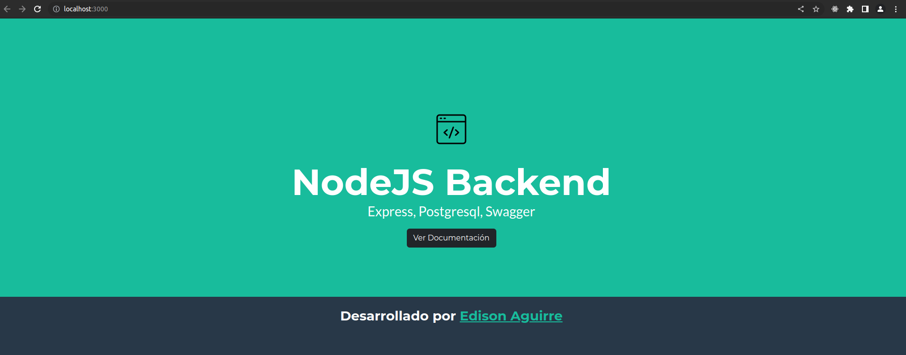
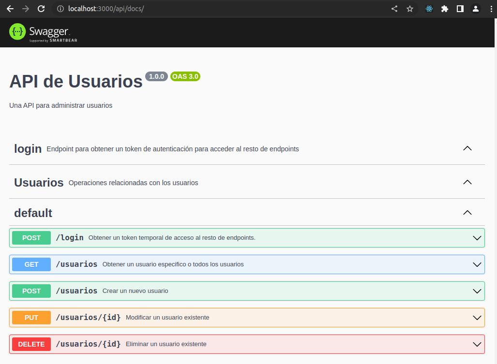

# Proyecto Backend (NodeJS v18.16.0, PostgreSQL)

Hola, comparto en proyecto muy sencillo y práctivo de **backend** desarrollado en **NodeJS/express**, el cual se conecta a una base de datos **PostgreSQL** y realiza el respectivo **CRUD** sobre esta tabla. Antes de consumir cada endpoint, es necesario obtener un token **JWT** para validar que el acceso si sea autorizado.

También comparto la documentación de los endpoints usando **Swagger** y la colección del consumo de los endpoints usando **Postman**. Adicional agrego configuración en **Docker** _(docker-compose.yml)_ para usar **PostgreSQL** desde un contendor.

Para instalar las dependencia de nodeJS, usar el comando:

    npm install

Al finalizar de descargar todas las dependiencias, podemos iniciar el proyecto en modo desarrollo (Usando nodemon), ejecutando el siguiente comando:

    npm run dev

Ahora accedemos a la página principal del proyecto

    http://localhost:3000/

Para acceder a la documentación en Swagger de la API, debemos acceder a la siguiente URL

    http://localhost:3000/api/docs/

## Directorios

### 1. docker

Dentro de este directorio esta el archivo para la ejecución de PostgreSQL desde un contenedor. Para ejecutar la configuración es necesario ejecutar el siguiente comando dentro de este directorio.

     docker compose up -d

Antes de ejecutar el comando anterior, es necesario crear un volumen en docker que tenga como nombre **postgres-db**.

     docker volume create postgres-db

### 2. endpoints

Dentro de este directorio se encuentra el archivo **usuarios.js**. En este archivo se encuentra todo el código realacionado al CRUD correspondiente a la tabla de usuarios.

### 3. postman

Dentro de este directorio se encuentra el archivo **node-pg-backend.postman_collection.json** el cual se puede importar como colección desde postman. En esta colección se encuentra las siguientes peticiones:

1.  **01-login**: Petición **POST** que permite obtener el token de autenticación.
2.  **02-usuariosListar**: Petición **GET** que permite obtener el listado completo de usuarios.
3.  **03-usuariosListarId**: Petición **GET** que permite obtener la información de un usuario consultando por su ID.
4.  **04-usuariosCrear**: Petición **POST** que permite crear un usuario.
5.  **05-usuariosEditar**: Petición **PUT** que permite editar toda la información de un usuario basado con su ID.
6.  **06-usuariosEliminar**: Petición **DELETE** que permite eliminar un usuario.

### 4. SQL

Dentro de este directorio se encuentra el archivo **usuarios.sql** con la estructura básica de la tabla usuarios. Esta estructura es muy básica, pero sirve como base para entender el desarrollo del backend.

## Variables de entorno

| VARIABLE    | VALOR                      | OBSERVACIÓN                               |
| ----------- | -------------------------- | ----------------------------------------- |
| DB_HOST     |                            | IP servidor PostgreSQL.                   |
| DB_PORT     |                            | Puerto para PostgreSQL.                   |
| DB_NAME     |                            | Nombre de la base de datos en PostgreSQL. |
| DB_USER     |                            | Usuario para conexión a PostgreSQL.       |
| DB_PASSWORD |                            | Contraseña del usuario.                   |
| CORS_ORIGIN | http://localhost:3000/api/ | URL para el manejo de CORS.               |
| JWT_SECRET  |                            | Clave para la generación de tokens JWT.   |
